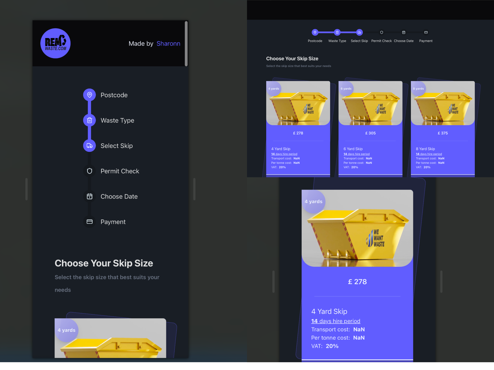

# ♻️ REM Waste Skip Selector (Redesign)

This is a modern, responsive redesign of the “Choose Your Skip Size” page for [REM Skip hire](https://remskiphire.com/skip-hire-rem), built with **Vite**, **React**, **Tailwind CSS**, and **DaisyUI**.

It uses the [WeWantWaste.co.uk](https://wewantwaste.co.uk) API to fetch the yard skips list.

---

## 🚀 Features

- 🔄 **Fully responsive** design (mobile-first)
- ♻️ **Real-time data** via API
- ✅ **Skip selection** with single-select logic
- 🖱️ **Interactive UI** with hover/focus states
- 🌈 Styled with **TailwindCSS** and **DaisyUI**
- ⚙️ Clean component structure with Vite / React Js

---

## 📸 Preview

> 
*Modern card UI layout with yard skip data and selection*

---

## 🔗 Live Demo

<!-- > [👉 Click here to view the demo](https://your-demo-link.vercel.app) -->

---

## 📦 Tech Stack

- **React 19**
- **Vite 6**
- **Axios** – for fetching skip data
- **Tailwind CSS** – utility-first CSS framework
- **DaisyUI** – component styling on top of Tailwind
- **React Icons** – for beautiful iconography (I only used Lucide icons)

---

## 🛠 Installation

```bash
git clone git@github.com:SharonnElfride/rem-waste-skip-selector.git
# OR
git clone https://github.com/SharonnElfride/rem-waste-skip-selector.git

# Next steps
cd rem-waste-skip-selector
npm install
npm run dev
